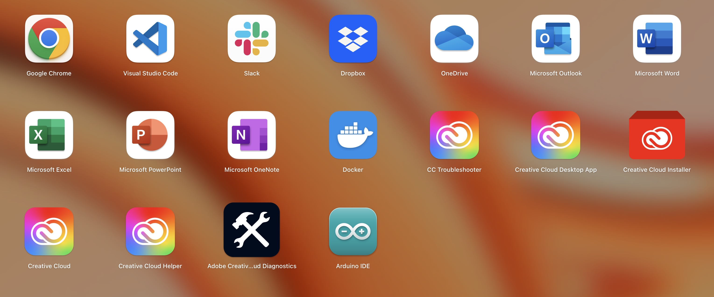

# SettingScript-MacOS

## Overview

研究室において必要なアプリケーション及びパッケージソフトをまとめてインストールする。
詳細はBrewfileを参照。

## Installation

1. ターミナルを開いて、[Homebrew](https://brew.sh/ja/)をインストールする
```
/bin/bash -c "$(curl -fsSL https://raw.githubusercontent.com/Homebrew/install/HEAD/install.sh)"
```

2. リポジトリをクローン後、パッケージをインストールする
```
brew bundle
```
時々、パスワードが求められることがあるので入力する。
